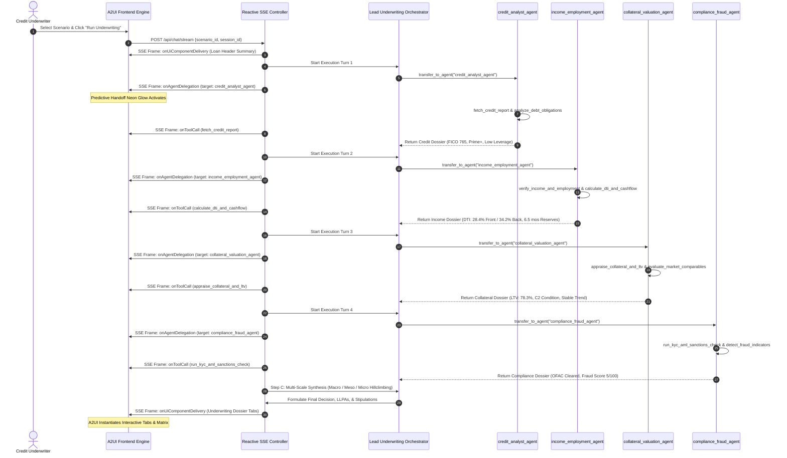
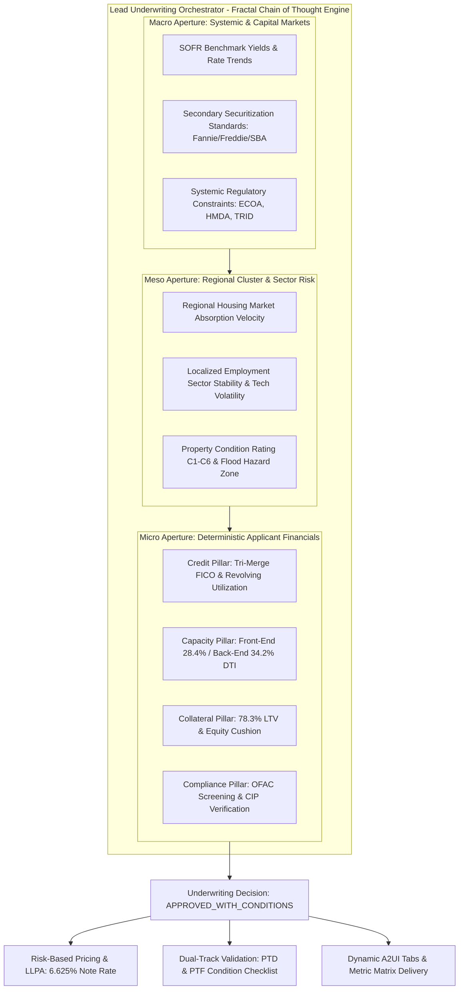

# ⚡ LoanFlow AI: Multi-Agent Loan Underwriting Platform

[](https://cloud.google.com)
[](https://cloud.google.com/vertex-ai)
[](https://github.com)
[](https://pytest.org)
[](https://python.org)

**LoanFlow AI** is an enterprise-grade, multi-agent automated loan underwriting and risk decisioning platform built on the **Google Cloud Agentic Stack (Agent Development Kit 2.x & Agent UI / A2UI 0.9)** and **Google GenAI Enterprise SDK** powered by Gemini on Vertex AI.

The platform coordinates specialized worker subagents within a strict **Hub-and-Spoke topology**, leveraging **Fractal Chain of Thought (FCoT)** multi-scale reasoning, **Hillclimbing synthesis**, and **Schema-Driven Dynamic A2UI presentation**.

---

## 🏛️ System Architecture

The platform decouples stateful multi-agent execution frames from stateless presentation environments, establishing a persistent unidirectional Server-Sent Events (SSE) data boundary transmitting standardized JSON-RPC 2.0 frames.

### 1. Macro-Level System Topology

```mermaid
graph TD
    subgraph Presentation_Layer [Dynamic Client Rendering Engine (A2UI Cockpit)]
        UI[Single-Page Glassmorphic Cockpit]
        Parser[Reactive Stream Parser & Dynamic Component Factory]
        Visualizer[Mesh Topology Visualizer & Predictive Glows]
        UI <--> Parser
        UI <--> Visualizer
    end

    subgraph Backend_Core [Backend Orchestration Service]
        Controller[Reactive Streaming Controller API (Flask SSE)]
        Supervisor[Lead Underwriting Orchestrator Agent (FCoT)]
        Epistemic[Shared Epistemic Context & State Tracker]
        
        Controller -->|Spawns / Wiretaps| Supervisor
        Supervisor <--> Epistemic
        
        subgraph Agent_Mesh [Isolated Specialist Worker Mesh]
            Supervisor -->|1. Turn A (Silent Transfer)| Credit[credit_analyst_agent]
            Supervisor -->|2. Turn B (Silent Transfer)| Income[income_employment_agent]
            Supervisor -->|3. Turn C (Silent Transfer)| Collateral[collateral_valuation_agent]
            Supervisor -->|4. Turn D (Silent Transfer)| Compliance[compliance_fraud_agent]
            
            Credit -->|Deterministic Tools| CreditTools[Credit Bureau & Debt Evaluator]
            Income -->|Deterministic Tools| IncomeTools[VOE & DTI / Cash Flow Engine]
            Collateral -->|Deterministic Tools| CollateralTools[Appraisal & LTV / Comps Evaluator]
            Compliance -->|Deterministic Tools| ComplianceTools[OFAC / CIP & Fraud Screener]
        end
    end

    %% Network Protocol Boundary
    UI <-->|POST /api/chat/stream Session Init| Controller
    Controller -->|SSE Event Stream (JSON-RPC 2.0)| Parser
```

---

### 2. Hub-and-Spoke Execution & Routing Isolation

Workers are strictly isolated using `disallow_transfer_to_parent=True` and `disallow_transfer_to_peers=True` to guarantee topological integrity, prevent recursive loops, and centralize decision consolidation in the Lead Orchestrator:



---

### 3. Fractal Chain of Thought (FCoT) 3-Scale Decomposition Engine



---

## 🤖 Specialist Underwriting Subagents

| Subagent | Role & Objective | Tools & Capabilities | Isolation Policy |
| :--- | :--- | :--- | :--- |
| **`credit_analyst_agent`** | Evaluates applicant creditworthiness, FICO scoring tiers, derogatory event seasoning, revolving utilization, and non-housing debt obligations. | `fetch_credit_report`<br>`analyze_debt_obligations` | `disallow_transfer_to_parent=True`<br>`disallow_transfer_to_peers=True` |
| **`income_employment_agent`** | Evaluates earning stability, W-2/1099/self-employment haircuts, calculates proposed PITI, Front-End DTI, Back-End DTI, and liquid reserve months. | `verify_income_and_employment`<br>`calculate_dti_and_cashflow` | `disallow_transfer_to_parent=True`<br>`disallow_transfer_to_peers=True` |
| **`collateral_valuation_agent`** | Assesses property appraisal vs purchase price, calculates LTV/CLTV ratios, inspects property condition (C1-C6), and checks flood/environmental hazard zones. | `appraise_collateral_and_ltv`<br>`evaluate_market_comparables` | `disallow_transfer_to_parent=True`<br>`disallow_transfer_to_peers=True` |
| **`compliance_fraud_agent`** | Executes KYC/CIP customer identification, OFAC Specially Designated Nationals (SDN) watchlist screening, PEP checks, and heuristic fraud anomaly scoring. | `run_kyc_aml_sanctions_check`<br>`detect_fraud_indicators` | `disallow_transfer_to_parent=True`<br>`disallow_transfer_to_peers=True` |
| **`underwriting_orchestrator`** | Lead Orchestrator executing sequential dispatch, Fractal Chain of Thought (FCoT) multi-scale synthesis, LLPA pricing, and dynamic A2UI schema delivery. | `transfer_to_agent`<br>`build_full_underwriting_tabs_a2ui` | Root Supervisor Node |

---

## 🎨 Dynamic A2UI Schema Components

The frontend dynamically instantiates high-fidelity presentation components delivered as declarative JSON definitions over SSE:

1. **Loan Header Card (`Card`)**: Real-time snapshot of borrower identity, requested amount, note rate, term, FICO badge, and collateral value.
2. **Interactive Underwriting Dossier (`Tabs`)**:
   - **Tab 1: Executive Decision & Pricing**: Decision badge (`APPROVED_WITH_CONDITIONS`, `APPROVED`, `DECLINED`), Recommended Interest Rate, and Loan-Level Price Adjustments (LLPAs).
   - **Tab 2: The 4-Pillar Financial Metrics Matrix (`Table`)**: Side-by-side comparison of applicant metrics vs agency benchmark limits with margin cushions.
   - **Tab 3: Subagent Research Dossiers (`Card`)**: Dedicated structured findings with explicit subagent attribution.
   - **Tab 4: Loan Conditions & Stipulations (`ConditionList`)**: Categorized Prior-to-Doc (PTD) and Prior-to-Funding (PTF) condition checklist.
   - **Tab 5: Macro/Meso/Micro FCoT Synthesis (`Card`)**: 3-Scale perspective analysis and Dual-Track Validation Action Plan (Defensive Track & Positional Track).
3. **Predictive Handoff Glows**: Live glowing neon rings light up target worker subagent nodes in the sidebar the instant `onAgentDelegation` is emitted.
4. **Self-Cleaning Placeholders**: Prevents hanging DOM elements when subagent streaming concludes.

---

## 🛠️ Tech Stack & Enterprise Compliance

- **Framework**: Google Agent Development Kit (ADK 2.x - `google-adk==2.8.0`)
- **LLM SDK**: Google GenAI Enterprise SDK (`google-genai==2.20.0`) powered by Gemini Enterprise
- **UI Protocol**: Agent UI (`a2ui-agent-sdk==0.5.0`, `a2a-sdk==0.3.26`, `a2ui-core==0.1.1`)
- **Backend / Streaming**: Flask 3.1, Flask-CORS, Server-Sent Events (SSE), JSON-RPC 2.0
- **Validation & Models**: Pydantic 2.13
- **Testing**: Pytest, Pytest-Mock, Pytest-Asyncio, Unittest

---

## 🚀 Quick Start & Local Execution

### 1. Prerequisites & Environment Setup
```bash
# Clone repository and navigate to workspace root
cd /Users/arsanjani/AntigravityRepo/codewell

# Activate the virtual environment
source .venv/bin/activate

# Verify enterprise environment flags
export GOOGLE_GENAI_USE_VERTEXAI="true"
export GOOGLE_CLOUD_PROJECT="arsanjani-genai"
export GOOGLE_CLOUD_LOCATION="us-central1"
```

### 2. Launch the Application
```bash
python run.py
```
Open your browser and navigate to: **`http://127.0.0.1:5000`**

### 3. Run Automated Test Suite
Run the unit and integration test suite:
```bash
pytest -v tests/
```

Test results:
```
============================= test session starts ==============================
collected 18 items

tests/test_a2ui_schemas.py::TestA2UiSchemas::test_full_underwriting_tabs_builder PASSED [  5%]
tests/test_a2ui_schemas.py::TestA2UiSchemas::test_loan_header_builder PASSED [ 11%]
tests/test_agents.py::TestAgentConfigurations::test_collateral_agent_isolation PASSED [ 16%]
tests/test_agents.py::TestAgentConfigurations::test_compliance_agent_isolation PASSED [ 22%]
tests/test_agents.py::TestAgentConfigurations::test_credit_agent_isolation PASSED [ 27%]
tests/test_agents.py::TestAgentConfigurations::test_income_agent_isolation PASSED [ 33%]
tests/test_agents.py::TestAgentConfigurations::test_orchestrator_subagent_mesh PASSED [ 38%]
tests/test_stream_api.py::test_session_endpoint PASSED                   [ 44%]
tests/test_stream_api.py::test_scenarios_endpoint PASSED                 [ 50%]
tests/test_stream_api.py::test_scenario_detail_endpoint PASSED           [ 55%]
tests/test_stream_api.py::test_stream_endpoint_schema_compliance PASSED  [ 61%]
tests/test_tools.py::TestUnderwritingTools::test_collateral_ltv_evaluation PASSED [ 66%]
tests/test_tools.py::TestUnderwritingTools::test_compliance_kyc_and_fraud PASSED [ 72%]
tests/test_tools.py::TestUnderwritingTools::test_credit_report_prime PASSED [ 77%]
tests/test_tools.py::TestUnderwritingTools::test_credit_report_subprime PASSED [ 83%]
tests/test_tools.py::TestUnderwritingTools::test_dti_calculation_compliant PASSED [ 88%]
tests/test_tools.py::TestUnderwritingTools::test_income_verification_self_employed_haircut PASSED [ 94%]
tests/test_tools.py::TestUnderwritingTools::test_income_verification_w2 PASSED [100%]

======================== 18 passed, 2 warnings in 0.52s ========================
```

---

## 📁 Repository Directory Structure

```
/
├── backend/
│   ├── __init__.py
│   ├── app.py                      # Flask API, SSE streaming controller & session manager
│   ├── config.py                   # GenAI Enterprise config & Vertex AI credentials
│   ├── models/
│   │   ├── __init__.py
│   │   ├── loan_application.py     # Pydantic schemas for Loan, Borrower & Decision models
│   │   └── a2ui_schemas.py         # Dynamic A2UI layout builders (Tabs, Cards, Tables, Badges)
│   ├── tools/
│   │   ├── __init__.py
│   │   ├── credit_tools.py         # Credit bureau pull & debt obligation evaluator
│   │   ├── income_tools.py         # VOE, DTI calculation & reserve months evaluator
│   │   ├── collateral_tools.py     # Property appraisal, LTV/CLTV & comps analyzer
│   │   └── compliance_tools.py     # OFAC/Sanctions check & synthetic fraud detector
│   ├── agents/
│   │   ├── __init__.py
│   │   ├── orchestrator.py         # Lead Underwriting Agent (FCoT Hillclimbing & SSE Engine)
│   │   ├── credit_agent.py         # Credit Analyst Specialist Subagent
│   │   ├── income_agent.py         # Income & Employment Specialist Subagent
│   │   ├── collateral_agent.py     # Collateral Valuation Specialist Subagent
│   │   └── compliance_agent.py     # Compliance & Anti-Fraud Specialist Subagent
│   └── workflows/
│       ├── __init__.py
│       └── sample_data.py          # Pre-loaded loan applications (Conventional, Jumbo, Commercial, Subprime)
├── frontend/
│   ├── templates/
│   │   └── index.html              # Glassmorphic UI cockpit layout
│   └── static/
│       ├── css/
│       │   └── style.css           # Modern financial dark-theme glassmorphism design system
│       └── js/
│           └── app.js              # SSE parser, predictive handoff visualizer & A2UI factory
├── tests/
│   ├── __init__.py
│   ├── test_tools.py               # Unit tests for underwriting specialist calculation tools
│   ├── test_agents.py              # Unit tests for ADK 2.x subagent isolation configuration
│   ├── test_stream_api.py          # SSE endpoint & JSON-RPC schema compliance integration tests
│   └── test_a2ui_schemas.py        # A2UI declarative component factory tests
├── run.py                          # Local server entrypoint
├── requirements.txt                # Version-locked dependencies
├── architecture.md                 # Master Technical Architectural Specification
├── orchestration.md                # Fractal Chain of Thought (FCoT) Lead Orchestrator Prompt Spec
└── sequential_multi_agent_development_guide.md # Google ADK & A2UI Best Practices Guide
```
